# 🤖 AI-Driven Development Assessment

> **An end-to-end demonstration of AI replacing the traditional development pipeline** — from UI/UX design to code implementation, testing, PR review, and quality assurance — built in under 2 days.

---

## 🎯 Objective

This project proves that a single developer, armed with AI tooling, can deliver a **production-grade Flutter application** at unprecedented speed. Every stage of the Software Development Life Cycle (SDLC) — design, development, testing, code review, and QA — was handled by AI agents orchestrated through MCP (Model Context Protocol) integrations.

The result: a fully functional **Feedback & Rating app** with Clean Architecture, BLoC state management, localization, automated tests, and a CI/CD pipeline — all AI-generated.

---

## 🏗️ AI Pipeline Architecture

The entire workflow was powered by **four AI systems** working in concert:

```mermaid
flowchart LR
    subgraph "🎨 DESIGN"
        A["📝 PRD\n(Product Requirement)"] --> B["🪡 Stitch AI\n(UI Generation)"]
        B --> C["🎨 Figma\n(Design Refinement)"]
    end

    subgraph "💻 DEVELOPMENT"
        C -->|"Figma MCP"| D["🚀 Antigravity\n(Code Generation)"]
        A -->|"Context + Rules"| D
        D --> E["📦 Flutter App\n(Clean Architecture)"]
    end

    subgraph "✅ QUALITY ASSURANCE"
        E --> F["🧪 Widget Tests\n(AI-Generated)"]
        E --> G["🤖 Gemini AI Review\n(PR Review)"]
        E --> H["📊 SonarCloud\n(Static Analysis)"]
    end

    subgraph "� CI/CD"
        F --> I["✅ GitHub Actions"]
        G --> I
        H --> I
    end

    style A fill:#1a1a2e,stroke:#e94560,color:#fff
    style B fill:#1a1a2e,stroke:#0f3460,color:#fff
    style C fill:#1a1a2e,stroke:#0f3460,color:#fff
    style D fill:#1a1a2e,stroke:#e94560,color:#fff
    style E fill:#16213e,stroke:#0f3460,color:#fff
    style F fill:#0f3460,stroke:#53a8b6,color:#fff
    style G fill:#0f3460,stroke:#53a8b6,color:#fff
    style H fill:#0f3460,stroke:#53a8b6,color:#fff
    style I fill:#1a1a2e,stroke:#e94560,color:#fff
```



### Role Mapping: AI vs Traditional

| Traditional Role | AI Agent Used | What It Did |
|---|---|---|
| **UI/UX Designer** | Stitch AI → Figma | Generated pixel-perfect mobile screens from text prompts |
| **Flutter Developer** | Antigravity (via Figma MCP + Stitch MCP) | Studied project rules, read Figma designs via MCP, and wrote all Dart code |
| **QA Engineer** | Antigravity + GitHub Actions | Generated widget tests and wired automated CI pipelines |
| **PR Reviewer** | Gemini AI Code Reviewer | Reviews every PR for bugs, security, performance, and Clean Architecture compliance |
| **Static Analyst** | SonarCloud | Continuous code quality, security vulnerability, and code smell detection |

---

## 🔄 How It Worked (Step by Step)

### 1️⃣ PRD → Stitch AI (Design Agent)
A Product Requirements Document (`prd.md`) was written describing two core features — **Login** and **Feedback Rating**. This PRD was fed to **Stitch AI** which auto-generated mobile UI screens matching the requirements.

### 2️⃣ Stitch → Figma (Design Refinement)
The Stitch-generated screens were exported to **Figma** for visual validation and minor refinements. This served as the single source of truth for UI specifications.

> 🎨 **[View the Figma Design](https://www.figma.com/design/KOQwMv6jASaf9wPFZm1Vkp/Untitled?node-id=0-1&p=f&m=dev)**

### 3️⃣ Figma → Antigravity (Code Generation)
Using the **Figma MCP** and **Stitch MCP** servers configured in Antigravity:
- Antigravity read the Figma designs directly via the MCP protocol
- It studied the project's **coding rules and conventions** (Clean Architecture, BLoC pattern, localization, etc.)
- It then automatically generated all Flutter code — pages, BLoCs, events, states, services, repositories, and routes

### 4️⃣ Antigravity → Tests (QA Agent)
Antigravity also generated **comprehensive widget tests** for both features, including:
- UI rendering verification
- User interaction testing (taps, input, state changes)
- BLoC state management testing
- Edge case and error state coverage

### 5️⃣ GitHub Actions → Gemini + SonarCloud (Automated QA)
Five CI/CD workflows ensure every push and PR is validated:
- **Flutter CI** — format check, static analysis, test execution
- **Gemini AI Code Review** — AI-powered PR review triggered by `/gemini-review`
- **SonarCloud** — continuous code quality and security scanning
- **License Check** — dependency license compliance
- **Main Pipeline** — integration validation

---

## 📊 AI Metrics & Token Usage

### Antigravity Metrics


### Antigravity Quota


### Stitch AI Metrics


---

## 📱 Features Built

### 🔐 Login Page
- Email & password authentication with real-time validation
- Password visibility toggle
- Loading state with disabled button during API calls
- Forgot password & sign-up navigation links
- Full BLoC state management
- Localized in English & Korean

### ⭐ Feedback Rating Screen
- Interactive 5-star rating with animated scaling
- Dynamic emoji that changes per sentiment:

  | Rating | Label | Emoji |
  |---|---|---|
  | ⭐⭐⭐⭐⭐ | Excellent | 🤩 |
  | ⭐⭐⭐⭐ | Good | 😊 |
  | ⭐⭐⭐ | Okay | 😐 |
  | ⭐⭐ | Bad | 😞 |
  | ⭐ | Terrible | 😡 |

- Comment text field with material design
- Submit button with loading state
- Success dialog on submission
- Full BLoC state management
- Localized in English & Korean

---

## 🏛️ Architecture

```
app/lib/src/
├── core/              # Shared configs, routes, DI, constants
├── domain/            # Business logic & entities (pure Dart)
├── presentation/      # UI layer (BLoC + Views)
│   ├── auth/          # Login feature
│   │   ├── bloc/      # LoginBloc, events, states
│   │   └── view/      # LoginPage
│   └── feedback/      # Feedback rating feature
│       ├── bloc/      # FeedbackRatingBloc, events, states
│       └── view/      # FeedbackRatingScreen
├── repositories/      # Data layer abstraction
└── services/          # External service integrations
```

**Patterns Used:**
- Clean Architecture (Domain → Data → Presentation)
- BLoC pattern with Equatable states and `copyWith`
- Repository pattern with abstract contracts
- Dependency injection via `get_it`
- `go_router` for declarative routing
- Localization via ARB files (Korean + English)

---

## 🔧 CI/CD Pipelines

| Workflow | Trigger | Purpose |
|---|---|---|
| `flutter_test.yml` | Push / PR to `main`, `development` | Format check, lint, tests |
| `gemini-review.yml` | `/gemini-review` comment on PR | AI code review (strict mode) |
| `sonar.yaml` | Push to `main` / PR | SonarCloud quality gate |
| `license_check.yaml` | Push / PR | Dependency license audit |
| `main.yaml` | Push / PR | Integration pipeline |

---

## 🚀 Getting Started

```sh
# Development
$ flutter run --flavor development --target lib/main_development.dart

# Staging
$ flutter run --flavor staging --target lib/main_staging.dart

# Production
$ flutter run --flavor production --target lib/main_production.dart
```

### Run Tests
```sh
cd app && flutter test
```

---

## 💡 Key Takeaways

| Metric | Result |
|---|---|
| **Development Time** | < 2 days |
| **Manual Code Written** | Minimal — primarily rule configuration |
| **AI-Generated** | UI designs, all Dart code, widget tests, CI/CD configs |
| **Quality Gates** | 3 automated (Flutter CI + Gemini AI + SonarCloud) |
| **Architecture** | Production-grade Clean Architecture + BLoC |
| **Localization** | 2 languages (English, Korean) |

> **This project demonstrates that AI can effectively replace an entire development team's workflow** — Designer, Developer, QA, and Reviewer — when properly orchestrated through MCP integrations and well-defined rules. The human's role shifts from writing code to **defining requirements and orchestrating AI agents**.

---

*Built with [Stitch AI](https://stitch.google.com) · [Antigravity](https://idx.google.com) · [Gemini AI](https://ai.google.dev) · [SonarCloud](https://sonarcloud.io) · [Figma Design](https://www.figma.com/design/KOQwMv6jASaf9wPFZm1Vkp/Untitled?node-id=0-1&p=f&m=dev)*
